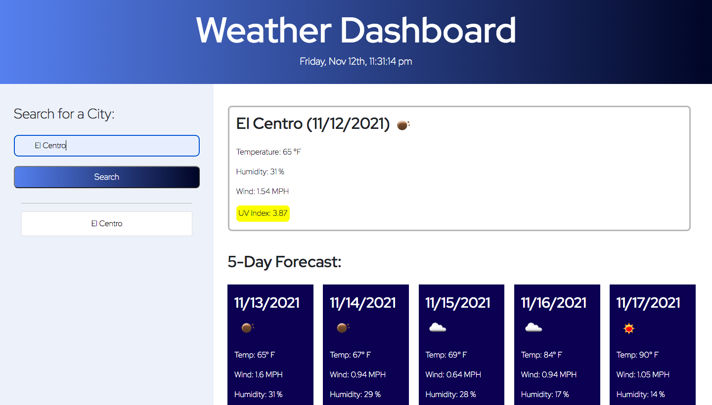

# Server-Side API: Weather Dashboard

## Table of Contents

* [Description](#description)
* [Snippets](#snippets)
* [Technologies](#technologies)
* [Preview](#preview)
* [Links](#links)

## Description

This project consisted on creating a weather dashboard website that will show the current weather condition and 5-day forescast of any city. Third-party APIs is going to acces the corresponing data from OpenWeather One Call API. This website will run in the browser and feature dynamically updated HTML and CSS.

## Snippets 

* **Fetching Weather API**
```            
var URL = "https://api.openweathermap.org/data/2.5/weather?q=" +cityname+ "&appid=" + key; 

    
    $.ajax({
      url: URL,
      method: "GET"
    }).then(function(response) {

        var iconid=response.weather[0].icon;
        var iconurl = "http://openweathermap.org/img/w/" + iconid + ".png";
        $('#wicon').attr('src', iconurl);
```            

* **Display of corresponding weather for loop**

```            
 for(i=0;i<5;i++)
    {
        var iconid = response3.list[i].weather[0].icon;
        var iconurl = "http://openweathermap.org/img/w/" + iconid + ".png";
        $("#icon"+(i+1)).attr('src', iconurl);
        $("#temp"+(i+1)).text("Temp: "+(parseInt((response3.list[i].main.temp)* 9/5 - 459))+"° F");
        $("#wind"+(i+1)).text("Wind: "+ response3.list[i].wind.speed + " MPH");
        $("#hum"+(i+1)).text("Humidity: "+ response3.list[i].main.humidity + " %");
    }
```


* **Function that saves city name to local storage**
```            
 function saveCity(city){
    if (city !== "") {
        cityArray.push(city);
    }
    localStorage.setItem("cities", JSON.stringify(cityArray));
    displayCity();
}
```   

## Technologies

* HTML
* CSS
* JavaScript
* Bootstrap
* Jquery

## Preview

This is a preview of the weather dashboard in a computer view. 



## Links

* [URL of the deployed application](https://analuciarojas.github.io/challenge6/)

* [URL of the GitHub repository](https://github.com/analuciarojas/challenge6)